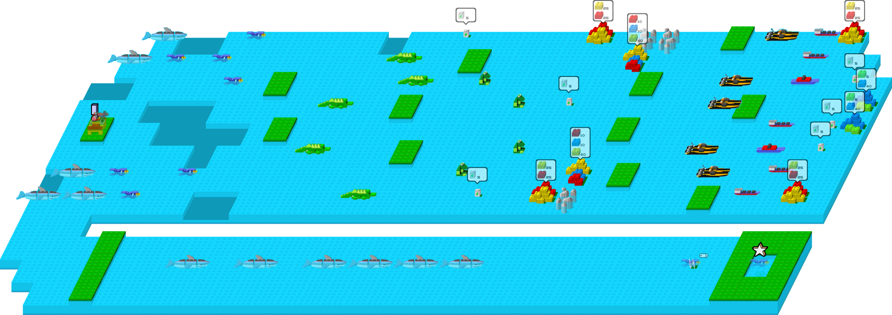

# Design System: Untitled

Initial design draft · September 28, 2026 · Current visual system refreshed September 30, 2026

**Implementation checkpoint:** 36 distinct handcrafted missions are playable in TypeScript and Phaser across Meadow Isles, Sunstone Range and Open Sea, with twelve missions per world. Three authored landscapes have twelve numbered pins each, compact pictured world controls, per-world counts and one earned resident per completed mission. Future maps are browseable while mission access requires every preceding main, including both world boundaries. The campaign builds from individual tools to combined engineering, transport, power and real-time automatic combat. The roster retains 20 original buildable counterparts and six hostile roles, alongside Hauler, Bristleback and Signal relay. Each visit has one main then one hidden optional bonus, fresh terrain, units, supplies and finite blueprint stock; saved awards persist when storage is available. Normal play uses one short objective and pictured shipment requirements, with mission hints inside How to play. Desktop cameras initially fit the actual board, including larger final boards at widths of at least 700px. Both audio channels start off on every load with separate current-session opt-in. See [the canonical registry](src/levels/missions.ts), [campaign guide](docs/CAMPAIGN.md), [prototype notes](docs/PROTOTYPE.md) and [roster guide](docs/ROSTER.md); balance remains provisional. GitHub Pages deploys the campaign from `main` through the tested build workflow.

**Reference research status:** The overall direction is established. The original has now been played through the tutorial and Mission 2 using a browser Shockwave emulator. Selection, movement, cargo actions, building, dismantling, and movement after switching models have been observed directly. The user's recollection supplies the working combat model: automatic attacks between adjacent opponents, with enemies wandering until nearby units trigger pursuit. Exact combat rules and later missions still need firsthand study. See the [play notes](docs/references/play-notes-2026-09-28.md).

## Overview

**Creative North Star: "Toy world"**

The implemented visual world uses original fitted toy machines, saturated molded-plastic colors, broad highlights, readable eyes, rounded leaf trees, and chunky stones. Bright cyan water and sunny sand sit beside spring-green grass on thick raised earthy faces, framed by deep navy and cool blue controls. Each machine has a clear role: a narrow lime Scout, a broad orange Hauler with an empty bed, a thick cobalt Warden, a compact yellow Scoop with turquoise arms and hubs, and a red six-legged Bristleback.

The [approved study](.impeccable/mocks/toy-world-study.png) and [approval record](.impeccable/mocks/toy-world-study.json) remain historical silhouette/material references. The [September 30 feedback contract](.impeccable/user-feedback-brief.md) supersedes illustrated rovers/rocks, textured terrain, the sidebar/mobile layout, Scoop cargo, and premature freighter scenery. Playable one-tile boats now belong to authored Open Sea missions; boat residents are earned only by completed boat-bearing levels there. Quiet broad terrain planes are a reversible trial, not a final user-approved style. The [campaign-rules contract](.impeccable/campaign-rules-brief.md) and [campaign expansion contract](.impeccable/campaign-expansion-brief.md) extend finite stock, ordered access, pictured goals and three landscapes while preserving this world. Authored mission geometry and sparse desktop controls govern composition; the study is an identity reference rather than a map composition comp. Attributed reference research and the historical gameplay discussion below remain intact.

**Key Characteristics:**

- Original glossy toy bodies with distinct role silhouettes and four direction views.
- Quiet terrain planes on raised coast geometry against a deep blue field.
- Shared pictures for board objects, blueprints, resources, and cargo.
- Sparse native controls with white text, yellow active states, and lime charge cues.
- Presentation motion that follows actual movement and freezes with pause or reduced motion.

**Historical toy-world redesign checkpoint · September 29, 2026:** The production build and 28 focused picking, orders-energy, and campaign tests passed. Browser checks observed a Scout reach a flag while Hauler remained selected, a three-alloy pickup with Hauler at 98 charge, Warden construction from the 3×3 area at 100 charge, both mission visits, and return to the map. Mission and world-map captures at 1280×720, 390×760, and 748×901 have matching canvas/host dimensions and no page overflow; the final browser warning/error log was empty. The finish review found the implementation faithful. The [final verdict](.impeccable/review/toy-world/finish-verdict.md) returned **ship** after the sole Persistence/FINISH documentation correction was resolved, with no regression. Ship covers that scored fix, not whole-surface approval. These checks cover the redesign and named interactions, not the whole game's balance or every mechanic. See [implementation evidence](.impeccable/review/toy-world/evidence.md) and the [finish review](.impeccable/review/toy-world/finish-review.md).

**Historical charm checkpoint · September 30, 2026:** The production build, TypeScript check, and 47 focused tests passed across narrow runs. Native browser checks covered the charged-battery bonus and saved starred flag, successive rising-star heights, Keep exploring, frozen pause poses, earned map residents, and music off at startup. Final keyboard checks confirmed that Space on a focused World map button returns with saved completion, while Space on the game surface skips the reward. Canonical map recaptures at 1280×720, 390×760, and 1234×901 show both completions and the Hollow Reach bonus; desktop and mobile mission captures retain the grounded toy imagery and sparse controls.

The [initial charm review](.impeccable/review/charm/finish-review.md) cleared visual craft and requested two event-boundary fixes. The [scoped final verdict](.impeccable/review/charm/finish-verdict.md) returns **ship**, resolving immediate goal/bonus progress publication and native Space activation, with no visible regression from the fix batch. That verdict covers those scored fixes, not whole-surface approval. Reduced motion was verified by source and pure-function tests because browser emulation was unavailable. Bramble's delivery bonus has simulation evidence; the browser regression reached its flag through pursuit and damage without validating that bonus or combat balance. Audio cues are event-wired without a listening claim. See [charm evidence](.impeccable/review/charm/evidence.md) for the exact scope and retained review history.

**Historical terrain-work checkpoint · September 30, 2026:** 82 unique focused tests and the production build passed. Native browser play verified distant digging, a two-cell fill, Scout crossing, and pristine restart. The corrected desktop (1440×1000), mobile (390×844), and user (781×901) mission/map captures passed the [full finish review](.impeccable/review/terrain-work/finish-review.md), returning **ship** with no material defect owed for Scoop / Siltwater Reach. Full native completion and new earned residents were not replayed in this run; shared simulation/campaign checks cover them. Reduced motion has source and focused test evidence without browser preference emulation; no audio listening claim is made. Three charge per successful terrain action remains provisional. See [terrain-work evidence](.impeccable/review/terrain-work/evidence.md).

**Historical desktop correction checkpoint · September 30, 2026:** 106 tests and the production build passed. The [fresh verdict](.impeccable/review/user-feedback/finish-verdict.md) returned **ship** for eight scored fixes: desktop controls, terrain treatment, model projection, colored parts, Scoop capabilities, rock footprint, freighter removal, and bridge/coast joins. [Evidence](.impeccable/review/user-feedback/evidence.md) records native desktop playback and captures at 1455×901 and 1920×1080. This covers the fix batch, not the whole game; audible sound, startup performance, balance, mobile layouts, and final terrain preference are outside the claim.

**Historical roster extension checkpoint · September 30, 2026:** The 194-test full suite passed before final small fixes; 107 focused tests and the production build then passed after them. The build passed again after the sole Build-help copy fix. Native 1280×720 and 899×900 captures were inspected and independently reviewed, with native tree work, shore cargo, Marina recharge, and Sentry construction. Public simulation commands completed all five new main objectives and bonuses, including Ancient combat/support/salvage; native play did not complete every mission. The [finish review](.impeccable/review/roster/finish-review.md) requested one help correction and the [scoped verdict](.impeccable/review/roster/finish-verdict.md) returned **ship** after it. [Evidence](.impeccable/review/roster/evidence.md) does not certify whole-game balance, exact original stats, audible audio, performance, or mobile behavior; the single detector output was truncated, with no clean-count claim. No new raster asset or visual-world replacement was introduced.

**Historical campaign-rules checkpoint · September 30, 2026:** the [finish review](.impeccable/review/campaign-rules/finish-review.md) returned **ship** with no material fixes. [Evidence](.impeccable/review/campaign-rules/evidence.md) records 219 passing tests in 19 files and a passing build, isolated native 1280×720 Hollow main/bonus progression, finite relay stock after dismantling, construction smoke and the next unlocked map state. The four-heading bot study establishes model presentation; later mission solves use public simulation commands. Native specialist completion, combat smoke capture, preference-emulated reduced motion, balance, performance and audible audio remain unclaimed. No raster/provenance asset changed.

**Current campaign expansion checkpoint · September 30, 2026:** [Evidence](.impeccable/review/campaign-expansion/evidence.md) records 259 passing tests in 24 files and public-command main/bonus solutions for all 36 canonical missions, with no direct solution mutation of charge, health, terrain or objective state. Tests cover unique boards, exact order, both world gates, saved/reset awards, known older awards, fresh stock, map paths and resident terrain. The Pages-base production build passed after the desktop initial-fit correction.

Native captures were inspected at the actual 885×901 desktop viewport. Populated maps and later replays use synthetic saved awards on isolated ephemeral origin 5190; the fixture is absent from production. Actual Parts and Paths play transported the kit, built one Scout with stock reduced to zero, completed its main, resumed through Try bonus, delivered the blue shipment and opened the final bonus popup. Ordinary origin 5189 used a pre-existing Hollow main/star award and showed Parts available, ten later Meadow levels locked and all twelve Sunstone levels disabled. A fresh Three Tides initial capture without Overview shows the complete board; the reviewer reopened it and closed the camera gap. No all-36 native completion, additional 1280 capture, mobile behavior, audio listening, performance benchmark, exact-original-stat fidelity or calibrated balance is claimed.

The [five-section finish review](.impeccable/review/campaign-expansion/finish-review.md) returns **fix** solely for stale current-scope documentation and the required final recording pass, with no extension UI repair remaining. This recording updates the actual tokens and sidecar previews. The [scoped finish verdict](.impeccable/review/campaign-expansion/finish-verdict.md) marks the documentation correction resolved and ready to ship, without whole-surface approval. The single detector pass records 33 advisory palette/radius/type documentation mismatches, not a mechanical UI defect or clean-zero audit. No raster or provenance asset changed; the 34-PNG manifest remains intact. Current deployment status is available in [GitHub Actions](https://github.com/Andrewp2/untitled-worldbuilder-game/actions/workflows/deploy-pages.yml).

**Whirlpools, tires and licenses checkpoint · October 1, 2026:** [Evidence](.impeccable/review/whirlpools-tires-licenses/evidence.md) records focused movement, resource, rank and model-projection checks and public-command solutions for all 36 mains and bonuses. The final source export excluding the matte trial passed all 293 tests in 28 files and the Pages-base production build. The source adds shallow-water spirals, shared tire pictures and a printable builder license. Native browser inspection and its screenshot alternative timed out, so this pass has no current screenshot, live interaction or print-dialog verification. Historical captures do not verify these additions.

**Play-feel checkpoint · October 1, 2026:** The [brief](.impeccable/play-feel-brief.md) adds shared construction feedback, authored patrol distraction and distinct creature gestures within this toy world. [Evidence](.impeccable/review/play-feel/evidence.md) records 311 passing tests in 31 files, all 36 canonical public-command main/bonus solutions, alternate main plans for Stone Gate, Forked Watch and Three Tides, and passing production and Pages-base builds. Finite shared kits, automatic adjacent combat and main-before-bonus progression remain; no retry-bonus checkpoint was added.

The two valid native captures are the Open Sea map and initial Stone Gate board at (777×901); Dozer blueprint collection was observed. Later ghost/patrol capture attempts produced no valid image. The construction ghost, pictured deficits, notice reactions, creature gestures, reduced-motion alternatives and completed mission plans therefore have source/test evidence without current native visual approval. Both captures include the preexisting local matte-lighting trial, which remains pending feedback and is excluded from this feature's publication; the published source retains MeshStandard materials. The [finish review](.impeccable/review/play-feel/finish-review.md) returned **fix** for this recording correction. The [scoped final verdict](.impeccable/review/play-feel/finish-verdict.md) returns **ship** after resolving the recording and explicit status-symbol sizing, without native visual approval of the new states. Ship covers those two scored fixes; it does not approve the whole game, all-36 native play, mobile behavior, audio, performance or balance. The one detector pass reported 12 advisory documentation mismatches and zero non-advisory findings, rather than a clean-zero audit.

## Colors

**Historical ground-contact correction:** Footprint origins, shared shadow depth, attached cargo sorting, ground/status separation, and quiet music startup were checked after user feedback. The build and 18 focused audio, picking, and grounding checks passed. The reviewer returned **ship**, scoring all four requested fixes resolved; see [the correction evidence](.impeccable/review/grounding/evidence.md) and [its scoped verdict](.impeccable/review/grounding/finish-verdict.md).

The UI palette places white and pale blue information on deep navy and cool blue surfaces; the world supplies the saturated character and terrain colors. Frontmatter records the reused UI values extracted from `src/style.css`, while authored models and retained cutouts define the world palette.

### Primary

- **Active Yellow** (`active`, with `on-active` text): active movement/cargo modes, selected blueprints, pause and mode readouts, focus outlines, and the primary **World map** completion action.

### Secondary

- **Charge Lime** (`charge`): remaining battery charge and ready status. Goal completion uses green cues; completed map locations now use flags rather than colored circular fields.
- **Role colors:** lime Scout, tangerine Hauler, cobalt Warden, yellow Scoop with turquoise arms/hubs and a blue rear battery, and cherry-red Bristleback belong to authored rover models and retained creature art. Their silhouettes and eyes carry identity alongside color. Dirt uses a warm-brown shared cutout.
- **License Gold** (`license-star`) and **Earned Stamp Green** (`license-stamp-earned`): the saved bonus-star total and completed-world stamps on the cream license.

### Neutral

- **Deep Navy** (`frame`) and **Island Blue** (`field`): application frame and canvas background.
- **Control Blue** (`panel`) and **Hover Blue** (`hover`): menu/details, hover labels, and interactive surface states; the translucent dock has its own token.
- **Cloud White** (`ink`), **Pale Blue** (`muted`), and **Blue Line** (`line`): primary text, secondary details, and structural dividers.
- **License Cream** (`license-paper`): the printable keepsake surface, with the existing dark blue `on-active` ink, muted pending stamps and a blue backdrop. Its close control uses the faint dark-ink `license-hover` fill.
- **Whirlpool Blue** (`whirlpool-fill`) and **Spiral Aqua** (`whirlpool-spiral`): a low water-plane pool with a readable pale spiral. **Tire Rubber** (`tire-rubber`) and **Tire Tread** (`tire-tread`) belong to the shared physical resource model.

**The Yellow State Rule.** Use yellow to identify the current command, selection, mission markers or primary completion action; use green for charge and completed-goal status.

## Typography

Locally bundled **Nunito Sans Variable** supplies native controls and resource counts. Mission/world headings use (20px); completion titles use (24px); selected names and hover-only location labels use (13px); details use (12px) with (1.5) line height. Pictorial actions retain accessible names and hover labels; costs, map names, and pile counts appear contextually. Empty cargo slots stay hidden.

**The Short Label Rule.** Keep the normal view to names, short goals, action labels, pictures, and counts. Put unit details and instructions behind their native disclosure controls; show one short objective with pictured shipment requirements, and keep mission-specific hints inside How to play.

Canvas labels and resource counts use pure white at 16px and 17px in world coordinates, rasterized at resolution 2; the camera scales them with the board. These are distinct from native control sizes.

The license retains Nunito Sans: a heavy title and class, a smaller bonus-star total, compact world stamps and a next-class hint. Its frontmatter roles record the sizes and weights; earned stamps strengthen their label weight to (850).

## Layout

The desktop board occupies the viewport. Small mission status sits at the upper left; the menu and camera controls sit at the upper right. A compact bottom toolbox (82px minimum height, 20px corners) holds always-visible pictured blueprints, selected name/charge and legal pictorial actions. Plans wrap with (8px) gaps and (4px) padding inside a bounded build region (520px maximum width); finite remaining counts stay visible, costs appear on hover/focus/selection, and exhausted blueprints are disabled. Units are selected on the board or with 1–9. Take apart acts immediately on the selected relay or stopped unit through its own action button; the blueprint tray has no take-apart targeting tool. Successful builds spend one blueprint; failure spends none, and dismantling/death never refunds stock. Music, effects, restart, and help live in the menu.

Three world landscapes share a compact upper-left heading, pictured previous/next controls and a per-world count. Meadow uses grassy banks and crossings, Sunstone uses sandy banks, rough patches and swamp, and Open Sea uses separated islands and water passages. Each landscape has twelve numbered native pins. Map and mission cameras derive their fit from actual grid dimensions; desktop visits initially show the whole board at widths of at least 700px.

Desktop is the requested device scope. The previous mobile reflow was removed by user preference. Refresh parent bounds before scale refresh when moving the shared canvas between hosts, so cameras and native pins use the same dimensions.

## Elevation & Depth

Depth comes from authored toy models, retained cutouts, raised terrain, footprint ordering, ground shadows, and diffuse UI shadows. All current unit/enemy roles, batteries, rocks, trees and four colored pieces render once through a shared Three.js (30-degree) orthographic camera into Phaser canvases. Rover/Bristleback/rock/tree pictures use (384×384) canvases, origin (192,280), and (96 world-pixel) display. Wheels and feet stay planted and the whole rock support hull fits its blocked cell. Runtime rendering reuses the canvases; startup performance has not been benchmarked.

### Shadow Vocabulary

- **Marker lift** (`drop-shadow(0 3px 2px #25410f60)`): separates mission symbols from the island. Names appear only on hover/focus.
- **Dialog separation** (`0 12px 40px #001e4566`): lift the completion dialog above its dimmed backdrop.
- **Dock separation** (`0 8px 22px #001e4540`), **menu/detail separation** (`0 6px 18px #001e4550`), **help separation** (`0 12px 35px #001b3d66`), and **feedback separation** (`0 5px 18px #001e4540`): keep contextual controls readable above the board.
- **License separation** (`0 16px 60px #00192f70`): lift the cream keepsake above its blue backdrop; the print stylesheet removes this shadow.

**The Ground Contact Rule.** Align cutouts to their physical footprint centers in `src/view/grounding.ts`, rather than the lowest alpha edge. Soft contact shadows share a ground layer beneath all upright objects. World objects sort by footprint position; cargo sorts inside its carrier. Idle bodies, facing changes, and flag masts preserve contact with the tile. A moving body may lift briefly during a step, while its footprint, sorting origin, and shadow stay on the terrain. Tile markings stay below bodies; charge bars and status remain above them.

Quiet grass/sand/water planes and sparse ripples are the current reversible terrain trial. Water lies (10 world pixels) below land tops. Land sides retain (10px) depth, including the abutments beside bridge tiles. Bridges have (4px) deck edges and narrow posts over the same lower water plane. Complete tiles paint back to front, keeping the land/deck joins continuous; ripples render beneath the deck and posts.

## Shapes

Machines use a few large fitted forms, visible joints, expressive front eyes and distinct overall proportions. Warden, Arborbot and Mender use four jointed walking legs with planted feet; work vehicles and cars retain their broad wheels. Hauler's empty bed leaves room for real carried parts; Scoop's front bucket holds a separate pictured dirt load. Bristleback keeps an articulated animal silhouette; trees have rounded leaf crowns and stones remain chunky. UI corners are gently rounded, with circular utility controls and soft rectangular controls. The completion dialog has a larger corner radius (14px); blueprint buttons have rounded rectangular corners (10px). Authored SVG symbols remain simple strokes for actions, status, and navigation.

The builder license uses the slightly broader `license` corner radius. Loose tires are dark horizontal rings with raised tread, sharing the toy camera and grounded support plane.

## Components

### Shared Toy Imagery

All current unit/enemy roles, batteries, rocks, trees, and red/blue/yellow/green part pieces are authored geometry in [toy-models.ts](src/view/toy-models.ts). The shared camera supplies exact bed/bucket cargo anchors at every heading; HUD thumbnails crop transparent margins without changing world anchors. Trees have six broad rounded canopy lobes, soft greens, warm trunks and two sizes, sharing the models’ camera, daylight and planted origin. Bristleback retains its six short legs, red segmented shell, ivory spines and blunt snout, with all four headings rendered from one model. Loose batteries use the same blue cylinder, collars and caps as installed ones, while retaining individual charge, gray empty-cell tint and charge strips. Generated flag, relay, soil, and connector cutouts retain calibrated origins in [grounding.ts](src/view/grounding.ts).

The roster extension and legged-bot refinement preserve this camera, lighting, planted support plane and four-heading grammar. Cargo specialists have distinct work bodies; creatures keep readable animal silhouettes; boat hulls occupy one tile. Water actors follow the 10px lower surface, shoreline movement interpolates height, and picking follows the rendered anchor. The extension adds no shipped raster assets.

**Historical raster inventory:** the [manifest](public/art/toy-world/manifest.json) retains 34 PNGs with embedded generation provenance: 20 directional views, ten object cutouts, terrain sheet, two source atlases, and freighter. Old generated rover/rock/terrain/freighter files are provenance/reference assets rather than active model art or scenery. Exact [Scoop](public/art/toy-world/scoop.prompt.txt) and [soil](public/art/toy-world/soil.prompt.txt) prompts and saved sources remain intact. Only retained illustrated views have direction-to-direction detail variation; no original reference art/code was copied.

### Buttons and Selection

Pictorial command buttons use transparent surfaces (53×57px) with (9px) corners. The active command has a muted fill and yellow inset mark; selected blueprints use a yellow outline. Blueprint buttons (56×58px) hold shared toy images (58×58px). Selection remains visible on the board. Circular menu/camera utilities use light-blue symbols and yellow hover/focus cues. Keyboard focus keeps an offset (3px) yellow outline; disabled opacity is (.3).

Game menu places one contextual reset control beneath its icon row, using the authored restart symbol, yellow action text (12px, 800), a softly tinted surface, and rounded corners (8px). Inside a mission, **Restart level** restarts only that mission on click and keeps saved completions and bonus stars; the hold hint is hidden. On the world map, **Reset ALL progress** shows a muted **Hold 3s** hint (11px, 500). A continuous three-second primary pointer, Space, or Enter hold changes the hint to **Keep holding…** and fills a yellow bottom meter (3px) linearly before clearing every campaign award. Release, pointer departure, focus loss, hidden tab, Escape, menu closure, or a screen change discards elapsed time; a short map click has no effect. The control retains the existing yellow focus outline.

Scoop exposes Move / Dig / Fill in the compact command strip. Pickup/Drop are hidden and the simulation rejects cargo transfers atomically, preserving terrain orders. Bucket contents and charge disable unavailable work; Space chooses Dig empty or Fill loaded. Long instructions remain in details/help.

Dozer adds Push and Arborbot adds Uproot/Plant to the same legal command strip; Space chooses the catalog default according to carried state. Unsupported cargo commands stay hidden for non-carriers. Support and automatic combat need no new action button; stationary structures omit Move/Stop. Pictured blueprints remain in the dock across selection and construction, and carried trees use a contained tree portrait.

### Pictured Objectives

The active goal uses the existing flag/star with shared (34px) creature portraits instead of a numeric single-goal counter. `or` separates alternative kinds; `original` identifies an authored rescue target, independent of which creatures are currently alive. Cargo, carried trees and minimum remaining charge reuse resource pictures, and the shield marks an enemy-clearance requirement. A title and accessible label spell out the complete requirement, including charged cargo batteries. The bonus replaces the main requirement only after the main is complete.

The action strip and hovered-tile information flow below this objective with (12px) gaps, so wrapped bonus descriptions cannot overlap the build controls. This refinement preserves the sparse desktop composition and introduces no extra panel. [The October 2 evidence](.impeccable/review/objective-clarity/evidence.md) records the native checks and their limits.

### Construction Preview and Feedback

Selecting a blueprint shows its shared toy picture at the hovered terrain tile, using the calibrated support origin and world depth. The ghost is translucent (alpha .55), with a neutral tint when ready and a warm coral tint otherwise; units use the existing (96px) picture size and Signal relay uses (76px). The surrounding tile outlines mark the same 3×3 supply area used by construction.

The contextual readout uses a lime check for readiness, shared ingredient pictures with missing counts for deficits, and a coral cross for an unsuitable or unavailable site. Check/cross symbols have an explicit (20×20px) size. Site problems take priority over ingredient deficits. An available empty battery remains legal: the ready check is accompanied by the gray empty-cell picture and empty charge strip. Exact reasons, missing quantities and the empty-battery readiness label live in titles and accessible labels; normal play gains no persistent instruction paragraph. Construction still spends one finite blueprint only on success. The explicit symbol sizing is source/build verified; no native recapture followed it.

### Cargo and Battery

Loose-part picture/count badges appear only while their pile's tile is hovered. Moving off the board, panning, zooming, or changing missions clears them. The same information is not repeated in a separate text panel. Battery charge strips and goal names remain visible.

Four distinct red/blue/yellow/green quantities persist through recipes, pickup/drop, construction, dismantling, wrecks, and bonus checks; colors cannot substitute. Cargo-capable rovers use pictured loads anchored inside their rendered bodies. Scoop’s one-dirt bucket is exclusive to Dig/Fill and cannot pick up/drop dirt. Bucket dirt becomes recoverable loose dirt through dismantling/destruction. Filled cargo pictures remain visible; empty boxes and the routine numeric capacity are hidden. Installed charge uses one green native progress bar (80×6px), with no repeated battery picture or visible number; the exact value is available on hover and through accessible value text. The battery-swap control appears when replacement is available. Installed charge remains fuel/health for mobile units and Sentry; dismantling preserves it, while an enemy wreck leaves the installed battery empty and carried batteries keep their charge. An empty battery still builds a powerless unit. Charging station, Bot workshop, and Marina instead show structural integrity and use automatic family support.

Tires use one shared ring-and-tread model in ground piles, hover counts, build costs and cargo pictures. Actual model cargo contains scaled tire geometry inside the carrier, alongside colored parts and batteries; it follows the same heading, lift and sorting as the carrier. Each tire occupies one cargo slot, and wheeled build costs show four pictured tires.

### Whirlpools

Linked shallow-water tiles carry pale spirals over dark blue elliptical pools on the same lower plane as other water. Their two-to-one projection follows the grid. Hovering an entry outlines its linked exit in yellow and names the destination in the contextual hint; routes break across the jump rather than drawing a walk through intervening terrain. The spiral turns with the existing presentation clock, freezing on pause and remaining static for reduced motion. Entry and exit briefly flash after a jump, with the existing signal cue; no audio listening check is claimed.

### Motion

Four direction views follow facing. Each grid step takes off and lands using the simulation’s actual step progress: Scout lifts (6 world pixels), Hauler (3.5), Warden (2.8), Scoop, Dozer and Bulk hauler (2), and Bristleback (1.5). Duck waddles on land with a (1.8px) lift and paddles in water with a (.35px) lift; Frog hops (8px), Snail glides with a (.25px) lift, and other water actors undulate by (.7px). Moving bodies rock and compress slightly; cargo follows their lift inside the carrier container. Shadows stay on the ground and become slightly smaller and lighter during a step. Footprints and depth sorting remain planted.

Idle gestures use the shared presentation clock. Duck briefly looks left then right during its (8s) cycle. Snail withdraws its head near a threat, preserving that static tucked pose under reduced motion. Idle predators sniff with a small (1.8px) dip and lean. Successful terrain/obstacle work and recharge reuse a (.4s) strain beat: Scoop dips (5px), other bodies dip (2px), and three warm dust particles mark the acted-on cell. Dozer leans into its push. Head poses reuse the same model, camera and support origin, without new raster assets.

Enemy acquisition uses the existing yellow exclamation, a brief body startle and a ground ring. Distant detection gives one (.45s) notice beat before pursuit; opponents already adjacent trade their first automatic volley immediately. The exclamation pops upward (9px) during the notice, while the ring fades over (.75s). Reduced motion keeps the exclamation, ring and Snail threat pose static. Forked Watch’s Bristleback and Crab follow authored circuits, wait at blockers and resume their circuit after a chase; ordinary creatures retain seeded wandering.

Pause freezes the current pose, work beat, flag cloth, selection bob and water ripples; hidden scenes suspend their idle clock. Reduced motion removes hops, rocking, idle looks/sniffs, work dip/puff, notice travel/stretch, cloth flutter, marker bobbing, resident patrols and control transitions, while gameplay movement and readable threat/outcome states remain. These preferences are read live. Presentation leaves destinations, energy, collisions and independent orders in the simulation.

Construction, dismantling and destruction use a code-drawn smoke billow over (.7s), revealing recovered piles beneath it. Its presentation clock freezes on pause; reduced motion uses a short static puff over (.25s). Construction remains immediate in the simulation. Native construction pixels support the smoke presentation; destruction and preference variants have source evidence.

Authored unit/enemy views share one model and camera per kind, preserving the corrected heading mapping in `src/view/facing.ts`.

### Mission Pins and Completion

Available native markers are yellow question marks; future missions use dark stationary locks and muted paths, with small numbers showing their campaign order. Completed markers are flags with optional earned bonus stars. Marker pictures occupy (42×48px) and bob over fixed ground shadows; names appear on hover/focus with pale-green labels. Names and hit areas stay fixed. CSS loops pause off-screen or while hidden. Each completed mission earns one chosen resident on its own authored landscape, using terrain-compatible patrols. Boat residents belong only to completed boat-bearing Open Sea missions. Replays and world changes do not duplicate residents.

Only Hollow starts unlocked. Meadow Isles, Sunstone Range and Open Sea contain twelve ordered missions each, as recorded in [CAMPAIGN.md](docs/CAMPAIGN.md). Every preceding main award is required to enter a later mission, including both world boundaries; bonuses never gate the next. Future landscapes can be browsed with the compact pictured world controls while mission buttons remain disabled. Existing known awards remain, but noncontiguous awards cannot bypass an earlier missing main.

Reaching a mission flag produces a yellow star that rises 76 world pixels over 1.25 seconds with cubic ease-out, with the existing signal or completion chime. Reduced motion shows the star without travel for 0.35 seconds. The final reward freezes the simulation before opening the borderless completion dialog; a canvas click, Space from the game surface, or Escape skips that short beat. Space continues to activate focused native buttons. Completion and newly earned bonuses publish in the event frame and save immediately, even if the player returns to the map during the reward. The dialog offers a yellow **World map** button or **Try bonus** button with minimum height (44px); resuming restores the previous pause state. The bonus marker, ground star and text appear only after the current visit's main completion, including replays. The bonus ending freezes the mission for the same reward, then opens **Bonus complete** with a starred flag, **Bonus star earned** and only **World map**; Escape also returns to the map, and the final run cannot resume. Each replay gets a new ending even with its star already saved, without a duplicate award.

Each mission has one main and one later optional bonus. Arrival flags can bind a role or the original authored unit. Convoy flags show required cargo beside the short goal; the loaded carrier must stand on the flag, and empty batteries do not qualify. Loose deposits cannot complete a flag. Hostile-clearance conditions can delay completion even after a loaded arrival. Every bonus requires an original or newly constructed creature/model to arrive; some also require a carried tree or remaining charge. Bonuses appear only after that visit's main. Exact definitions live in [missions.ts](src/levels/missions.ts) and its imported content files; [CAMPAIGN.md](docs/CAMPAIGN.md) describes the distinct challenges. Cargo stays aboard at completion; earned stars persist after leaving the target. Ground blueprints are finite pickups collected by walking a mobile model onto their tile, with some revealed only after the main. Visits restore authored terrain, materials, units and finite stock; prior awards do not reveal a bonus early.

### Builder’s License

A yellow pictured license beside Game menu opens a centered, borderless cream keepsake with dark blue ink. The shared toy portrait occupies a (170×145px) image area. Class 1 shows Scout; earned Classes 2, 3 and 4 show Frog, Dumptruck and Warden at 12, 24 and 36 saved bonus stars. The total counts unique awards. Three world stamps change from muted map symbols to green check symbols with stronger labels after all twelve mains in that world are complete.

The close control uses dark blue focus and hover cues on the light surface. Opening the license pauses an active mission; closing it restores the prior pause state. **Print license** is a separate full-width yellow action with a (44px) minimum height. Source print styles select A5 landscape with (12mm) margins and hide the game, close and print controls. The current browser and print output remain unverified.

## Do's and Don'ts

### Do:

- **Do** reuse the same toy pictures across the board, blueprints, recipes, resources, and cargo.
- **Do** use calibrated footprint centers, raised land faces, and the shared ground-shadow layer.
- **Do** keep authored levels and camera controls authoritative over the study's illustrative arrangement.
- **Do** keep command, charge, selection, and hazard states readable above bright terrain.
- **Do** freeze presentation motion on pause or reduced motion while preserving independent orders and existing rules.

### Don't:

- **Don't** restore the superseded mint/teal/warm-paper placeholder palette on current game surfaces.
- **Don't** use LEGO marks, studs, figures, or copied models for this original world.
- **Don't** bake inventory, a floor, or cast shadows into the reusable character pictures.
- **Don't** treat the approved art study as a pixel layout contract or the focused evidence as whole-game validation.

# Historical game design discussion

The following sections preserve the original design discussion and attributed research. Current implementation statements have been reconciled where the campaign now settles an earlier question; proposals and unverified reference observations remain labeled as such.

## Concept

An original game inspired by the construction, movement, and combat of the old LEGO World Builder browser games. Players command specialist units through handcrafted missions, move supplies across the map, change the terrain, and assemble or dismantle machines to meet each challenge.

The campaign should grow from small construction puzzles into larger real-time tactical missions. Later levels should offer more units, threats across a broad map, and room to develop a strategy. Players coordinate individual movement orders and position models to use their abilities or engage enemies. Construction and transport should remain useful as combat becomes more demanding.

The project will have its own identity, artwork, characters, names, and levels. `untitled-worldbuilder-game` is the working project name. The setting and final title are undecided.

## Direction established so far

These points come from the project discussion:

- **Handcrafted levels.** Deliberate terrain, resources, enemies, and objectives give each mission its own character.
- **Real-time movement and hazards.** Timing, positioning, and managing attention are part of play.
- **Construction as a game mechanic.** Building useful units and applying their different abilities is central to the concept.
- **A broader tactical game in later missions.** The reference includes substantial combat scenarios, especially Ocean World’s final mission.
- **Original content.** Use the reference to understand mechanics and pacing while developing a new game and new levels.

The systems below preserve the proposed starting direction. The implemented roster, three worlds, 36 missions and current rules are recorded above; statistics, balance, the final title and broader setting remain open.

## What matters in the reference

The original combined spatial resources with specialist units. Construction used parts in the 3×3 area centered on the chosen tile, including the four diagonals (clarified by the user). Dismantling returned parts to the ground, and each build consumed a model-specific plan. Units differed in movement terrain, carrying capacity, and abilities such as moving trees, pushing boulders, reshaping shorelines, or fighting enemies. Movable units required a battery; movement and actions drained it. The user clarified that an empty battery still allowed construction, but the resulting unit could not move on its own.

There were also two scales of play: a landscape used to select missions, and separate terrain boards for the missions themselves. The first game’s expanded campaign contained five worlds of twelve missions. Available missions used question marks; completion added flags and bonus completion added stars. Completing missions usually opened one or two more, and friendly models increasingly populated the campaign map. [Reference rules and campaign structure](https://brickipedia.fandom.com/wiki/World_Builder)

These are reference facts, not a commitment to reproduce every rule or count. The prototype adopts finite per-model plans, spending one on each successful build without refunds, and batteries with preserved, depletable charge. Energy costs and battery replacement balance remain provisional.

**Further reference recollection from the user:** goals generally required moving a creature to the goal rather than building a static structure there. The user remembers battery charge also acting as health, and destroyed creatures breaking into parts with an empty battery. Those parts could be rebuilt into an intact but powerless creature. We use this as the working model for rover objectives, damage, and wreckage; exact reference behavior still needs direct confirmation.

### The late-game reference

*Design reference from LEGO World Builder, supplied by the user.*

The screenshot shows boats and supplies concentrated toward the right, hostile gators across the central water, sharks near the left approach, and a lower passage containing more sharks toward the bonus objective. Land patches and gaps divide the space into approaches and passages.

The user identifies this as an example of the game becoming more RTS-shaped in its later missions. The image establishes the scale and placement of threats and supplies. An early-mission play session confirmed that a model continues its movement order after another model is selected. The user's recollection describes automatic combat at adjacency and enemies switching from wandering to pursuit when units enter detection range. Group selection and queued orders have not been established.

This mission is a useful design reference from the beginning. A prototype should demonstrate that the construction mechanics still work when several units and threats demand attention.

## Campaign and mission structure

### Campaign map

The current campaign uses three authored landscapes: Meadow Isles, Sunstone Range and Open Sea, each with twelve numbered locations. Their routes follow an irregular lagoon coast, a winding rocky valley, and an island chain with dotted sea lanes respectively. Authored bends connect the markers through the landscape; pins retain campaign order while their positions follow coves, clearings and passes. Hover/focus names sit outside fixed marker hit areas. Earned residents use distinct compatible patrols away from the pins. Main completion opens the next level in one order, including world boundaries. The initial proposal for occasional branches remains historical; branching is not current campaign behavior.

World-map backgrounds extend the surrounding ocean across the viewport: shallow cyan (`#48b7d3`) for Meadow and Sunstone, deeper blue (`#328dab`) for Open Sea. Smaller authored coasts use the existing terrain and prop models, with forests, rock formations or sandy reefs specific to the world. They sit outside the mission landscape, below its terrain layer, and add no clickable destinations or premature residents. World-map water omits its old raised board edge; mission boards retain their existing edges. Quiet swell geometry is baked on layout changes and one layer drifts with the existing clock, freezing when hidden or motion is reduced. Backgrounds resize with the camera without moving mission pins. The world heading, counts and navigation use dark ink (`#00182d`), retaining at least 4.7:1 text contrast against both sea colors. Mission UI colors remain unchanged.

Locations show available question marks, locked future missions, completed flags and earned bonus stars. Each main completion also adds one role-appropriate resident to that world on compatible terrain; replays do not duplicate it.

The current scope settles the world themes and count at three ordered worlds and 36 distinct handcrafted missions. Any expansion beyond those worlds, additional cosmetics and player-calibrated balance remain open.

#### Historical world-map checkpoint · September 29, 2026 · before the toy-world redesign

This retained checkpoint describes the earlier placeholder visuals and their review. The current visual system and evidence above supersede its palette, completion-action color, and no-raster description; its mission behavior and historical verification remain part of the project record.

The prototype now opens on a separate handcrafted 20×16 island landscape, using the existing isometric terrain, mint grass, teal water, and a pale dotted trail between Hollow Reach and Bramble Crossing. Native HTML mission buttons pair circular question-mark pins with warm paper name labels; completed locations use green flag pins. A brief heading and completion count accompany the landscape. Both missions are selectable immediately and remain replayable. Unlock gates, branches, and bonus stars belong to future progression rules.

Reaching all of a mission's flags opens **Mission complete** once per run and pauses the mission. **World map** returns to the landscape; **Keep exploring** or Escape restores the previous pause state. Each mission visit starts fresh. Only known completed mission IDs persist in local browser storage, with session progress still working when storage is unavailable. Returning early does not mark completion.

The new controls extend the existing locally bundled Nunito Sans and warm paper interface. Pins are 56px circles with short pointers; pins and name labels use blurred shadows (0 5px 12px and 0 3px 8px). The completion dialog has rounded corners (14px), a green **World map** action, and buttons at least 44px high; its diffuse shadow provides separation without a border. Native controls remain above the shared canvas during screen changes. The map fits the viewport and uses a narrower framing below 700px; reduced-motion preference freezes water movement and removes control transitions. Terrain is drawn geometrically and markers use authored SVG; no new raster assets were added.

**Verification checkpoint:** 28 focused campaign, rover-goal, and audio checks and the production build passed. Reconnecting browser controls restored testing: real Scout arrivals, the completion popup, both completion actions, mission switching, fresh replay, and saved completion after reload passed with no console errors. Map captures were inspected at 1280×720, 390×760, and the user's 1082×901 viewport, alongside desktop and mobile completion dialogs. The reviewer returned **ship**, scoring both visual fixes resolved; see [the review evidence](.impeccable/review/world-map/evidence.md).

### Individual missions

Each mission has an authored terrain layout, starting units, supplies, available construction options, enemies, and objectives. The implemented foundation is a square logical tile grid presented isometrically, with explicit camera movement and the toy visual system recorded above. Current terrain categories and the complete campaign are implemented as recorded above; further development and balance remain open.

Terrain creates meaningful differences between units through grass, sand, swamp, boardwalk, rough ground, shallow water and deep water profiles. Islands, channels, narrow crossings, and obstacles can divide the map into regions that require different tools or tactics to reach.

The map can change during play. Moving an obstacle or altering a shoreline may create a route, close an approach, or let supplies reach another area. Those changes should interact with combat as well as traversal.

Every current mission has one clear main objective and one hidden optional bonus. Authored goals require role/original-unit arrival; convoy mains also require cargo aboard, and some missions require all hostiles cleared. Terrain and construction challenges make those objectives possible; additional objective types remain future design options.

Mission state is self-contained: visits restart terrain, units, supplies, batteries and finite plans. Saved main awards and bonus stars carry across visits and generate earned residents; in-progress state and inventory do not carry between missions.

## Proposed gameplay systems

### Build, use, and repurpose

The basic loop is to examine the situation, get materials into position, build a useful unit, use its abilities, and reassess. Dismantling can release materials for the next job. Losses can change what remains possible.

The proposed resource system keeps supplies physically on the map. A stockpile’s location should matter: moving materials across a channel or through a dangerous area creates decisions of its own. Transport units need a purpose throughout the campaign.

The current prototype uses red, blue, yellow and green parts, physical batteries and terrain-work dirt; construction draws loose supplies from the full 3×3 area and is immediate. Recipe costs and recovery balance remain provisional.

### Specialist units

Start with a small set of roles that interact well:

| Role | Purpose | Decisions it should create |
| --- | --- | --- |
| Transport | Move construction materials or supplies | Capacity, route, protection, and delivery location |
| Terrain work | Move obstacles or alter traversable space | Which route to open and when to commit resources |
| Combat | Protect other units and engage threats | Position, concentration of force, and retreat |
| Support | Restore or sustain useful units, if included | Where to place support and how to keep it accessible |

These are roles to investigate, not final units. Distinct terrain access can cut across them. Favor abilities with several uses so that new level layouts can create new problems without constantly introducing another unit type.

### Real-time tactics and hazards

Missions should reward planning and let the situation change while the player executes that plan. Players need to decide where to send units, which threats to engage, and when to redirect attention elsewhere.

**Reference behavior, from the user's recollection:** there is no attack button. The player moves a combat model into position, and opposing models attack automatically when next to one another. Enemies wander in an apparently random way until a friendly unit comes within a detection range, then chase it directly.

Use this as the working combat model for the design. The player's decisions concern approach, contact, retreat, and the safety of other models while enemies are moving. Unlike cargo handling, engaging an enemy does not require entering a separate action-targeting mode. A plausible tactical consequence is that movement can draw a pursuing enemy toward a chosen position; this is a design implication to explore, not an observed tactic from the play session.

Threat behavior must be readable enough for deliberate tactics. The prototype uses four-step detection, six-step pursuit retention, nearest-rover targeting, and automatic attacks at orthogonal adjacency. Rover battery bars, enemy health bars, alert marks, impact flashes, and wreckage communicate danger and losses. These are our provisional rules; exact ranges, timings, and target selection can change through playtesting.

The user clarified that the reference requires a battery for every movable unit, drains it through movement and actions, and permits construction with an empty battery. Our prototype adopts that model with a single rover endurance pool: movement, actions, and enemy damage all drain installed charge. Transport, dismantling, and rebuilding preserve charge. A lethal enemy hit leaves the installed battery empty; batteries carried as cargo keep their charge. Spending the last charge through movement or actions leaves an intact rover, so battery delivery can restore it. Capacity, costs, damage, and any future repair or resupply systems remain our own provisional choices.

### Controls and information

The input sequence is part of the reference's design and needs to be described before proposing changes. “Point-and-click” alone is too vague to specify it.

**Played and observed directly:** the following sequences were performed in the original game running in [DirPlayer](https://dirplayer.com/worldbuilder). The tutorial's main goal and Mission 2's main and bonus goals were completed.

- **Select and move:** click a model, then click a destination on the map. An overhead arrow and the sidebar identify the selected model. In Mission 2, a single destination click took the buggy around trees to the goal; a second destination order reached the bonus goal.
- **Switch models:** after sending the duck across open ground, immediately select the buggy. The duck continues to its destination while the buggy remains selected. Selection does not cancel the duck's movement order.
- **Pick up cargo:** move the buggy beside a pile, click Pick Up, then click the adjacent pile. Action mode displays directional target markers around the model, including crosses for unavailable directions. The tutorial pickup loaded the blue bricks and changed the available cargo action to Drop Off.
- **Use the keyboard shortcut:** with the buggy selected, press Space to enter its action-targeting mode, then click the adjacent pile. This was also used successfully to pick up yellow bricks after the tutorial.
- **Move and unload:** after picking up the blue bricks, click a destination to drive there; choose Drop Off and click a neighboring target to place the cargo on the ground. Cargo handling therefore involves positioning, activating an ability, and choosing its local target.
- **Collect and use a plan:** move a model over the plan on the ground. Select the acquired plan in the bottom tray; the sidebar shows its recipe. Click a valid empty location beside the supplies to assemble the model. This succeeded twice for the tutorial buggy.
- **Dismantle:** select the model and click Take Apart. The tutorial buggy became a loose parts pile, which was then used to build another buggy nearby.
- **Look around:** click the viewport's edge arrows to scroll in steps. The camera also shifted during model selection and travel; its exact tracking thresholds remain unmeasured.

These observations distinguish issuing a movement destination from entering a model's local action mode. They support overlapping individual movement orders. Detailed observations and the unfinished Mission 3 placement experiment are recorded in the [play notes](docs/references/play-notes-2026-09-28.md).

**Further reference rules, clarified by the user:** Space-targeted drop-off can target a distant tile; the buggy drives beside that tile and attempts the drop-off. Movable units require batteries even for construction, but empty batteries are valid ingredients and leave the built unit unable to move. Blueprint resource access is the full 3×3 area centered on the site, not only its orthogonal neighbors. The prototype applies travel-to-target orders to both pickup and drop-off; the corresponding pickup behavior is an explicit design choice.

**Combat input, from the user's recollection:** select a combat model and move it beside an enemy. Attacking then happens automatically; there is no attack button or explicit attack-targeting step. This is separate from the manually activated cargo actions observed above. Combat has not yet been tested firsthand during this work.

**Still to verify directly:**

- What stops or replaces an existing movement order, other than reaching its destination?
- What are the limits of route-finding? What happens when a destination is unreachable or a route becomes blocked?
- Beyond the user-confirmed distant drop-off, which other reference abilities move their unit into range automatically?
- When does an action return to movement mode, repeat, or require another explicit selection?
- For automatic adjacent combat, what are the attack interval, target-selection rules, and effects of movement or selection changes?
- What is the enemy detection range, and when does pursuit end or switch targets?
- Beyond movement and automatic combat, do unselected friendly units initiate or repeat any actions?
- How do scrolling and camera controls interact with selection and movement?

The proposal to explore group selection and shared orders has been withdrawn from the initial design. Any such addition should be considered only after the reference's actual control behavior is understood and the desired change is explicit.

The first interaction prototype should focus on selecting a model, moving it, choosing an action, targeting that action, switching models, and building or dismantling. It should make selection, cursor mode, legal targets, and resulting behavior visible. Further interface proposals depend on that foundation.

## Level design and progression

The proposed progression expands the player's responsibility:

1. **Learn a tool.** A short mission gives one ability a clear use and enough room to understand it.
2. **Combine tools.** Terrain and supply placement require several roles or a sequence of builds. Hazards introduce timing and protection.
3. **Handle a larger encounter.** A larger mission presents more units, threats, and approaches. The way the player coordinates them depends on the control model still being investigated.

This is a change in the balance of challenges, not a rigid division into three campaign chapters. Later missions should continue using transport, construction, and terrain manipulation.

For each level, record its main challenge, starting conditions, intended uses of unit abilities, enemy behavior, primary objective, and optional bonus. Also record any known ways the player can become stuck. Early puzzles may impose tight resource constraints; larger tactical missions should give enough room to respond to losses and try alternate approaches.

Levels should be easy to author and revise. Begin with a readable level format or whatever simple authoring method the chosen engine provides. Decide whether a custom editor is worthwhile after making several levels.

## First playable scope

Base a small interaction prototype on the observed movement and cargo sequences and the user's account of automatic adjacent combat. Include movement after selection changes, enemy wandering, detection, and pursuit. Choose provisional values for unresolved ranges and timings explicitly, then use focused play and reference checks to refine them.

After that, the proposed playable slice has two complementary missions:

- **A construction mission:** move materials, assemble a useful unit, cross or change an obstacle, and complete an objective. This exercises the spatial resource loop.
- **A tactical mission:** use several friendly units against real-time threats across more than one approach, with useful supplies away from the immediate engagement. This exercises the established controls alongside combat, transport, and camera movement.

The tactical mission should use enough of the same systems to reveal whether they remain useful at a larger scale. A tiny tutorial alone would leave that question unanswered.

Use only the units and terrain needed for these missions. A full campaign, polished art, and elaborate progression can follow once the playable slice establishes the direction.

Judge the slice by whether players can understand their options, execute orders reliably, use construction during a changing situation, and recover or restart without confusion. Look for useful tactical alternatives and for whether transport remains worth doing under pressure.

## Open decisions

This table preserves the questions from the initial discussion. The current prototype has since established TypeScript/Phaser, isometric presentation, and the approved toy art direction. Its provisional rules are recorded above and in [the prototype notes](docs/PROTOTYPE.md); the final title, broader setting, further systems, and balance still need development.

| Decision | Why it matters |
| --- | --- |
| Setting and visual identity | Establishes what units, materials, environments, and enemies are |
| Platform, engine, and art approach | Determines the development workflow, camera options, and asset needs |
| Resource types and recovery rules | Sets the complexity and flexibility of construction |
| Plans and construction limits | Current prototype: finite per-model stock, one spent per successful build, no refund on dismantling/death; fresh visits restore authored stock |
| Energy, health, repair, and resupply | Sets the consequences of travel and combat, and the role of support |
| Combat details and enemy behavior | With automatic adjacent attacks and wander-to-pursuit as the working model, define detection range, attack timing, target choice, and disengagement |
| Selection, movement, and action behavior | Establishes the actual interaction loop, including what happens when switching units |
| Pause and time controls | Affects how much simultaneous attention missions demand |
| Failure and recovery | Defines when losses require a restart and how a stuck state is communicated |
| Campaign progression and persistence | Current prototype: 36 ordered missions in three worlds of twelve, each main unlocks the next across world boundaries; a current-visit main reveals its bonus, saved awards persist and visits restart fresh |

## Further reference work

- [Original game rules, unit descriptions, and campaign structure](https://brickipedia.fandom.com/wiki/World_Builder).
- [Stitched maps of the original game's levels](https://rockraidersunited.com/topic/9159-lego-worldbuilder-maps/), useful for studying terrain, supply placement, and scale.
- [Full gameplay recording of the first game](https://www.youtube.com/watch?v=GH7yPWbGtWE). Selected tutorial frames and the pickup sequence around 1:34–1:38 have been inspected; later combat and the full playthrough have not been reviewed.

This draft draws on the discussion, written references, inspected map images, selected tutorial footage, the user-supplied late-game example and combat recollection, and a firsthand session in the original running in DirPlayer. The session completed the tutorial's main goal and Mission 2's main and bonus goals, and began Mission 3. The remembered combat loop is the working model; its exact rules, energy use, and late-game coordination still need direct study. Emulator behavior should be considered when investigating anything unexpected.
